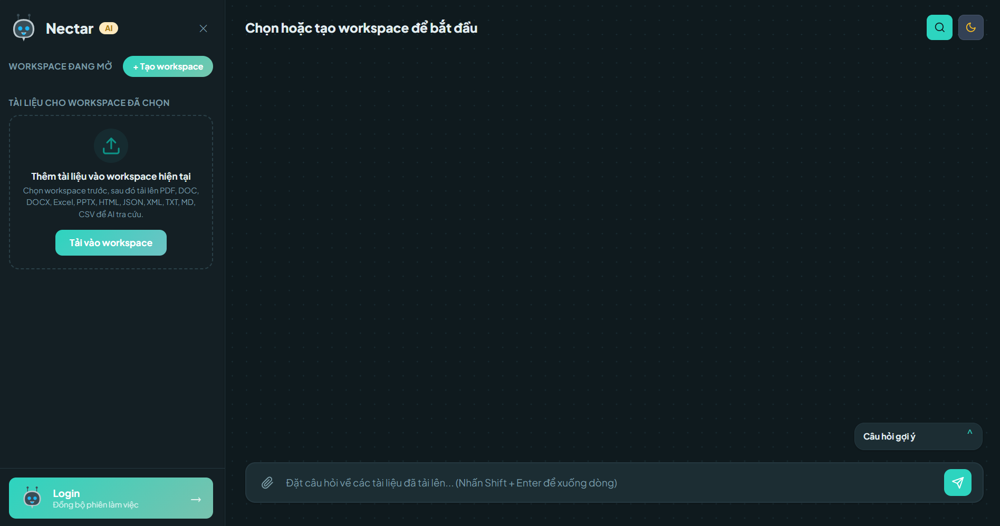
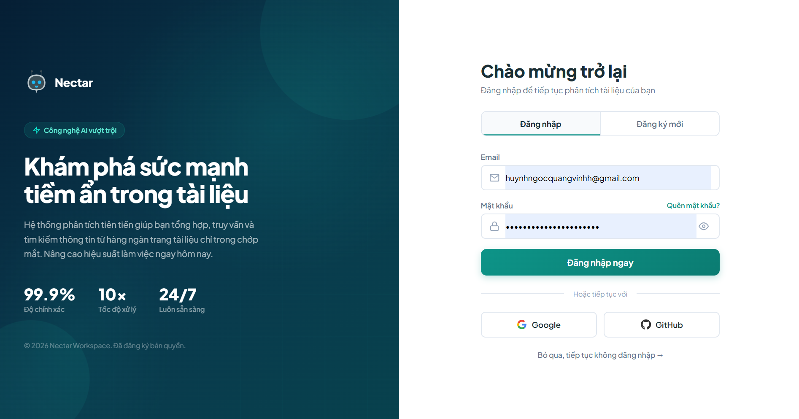
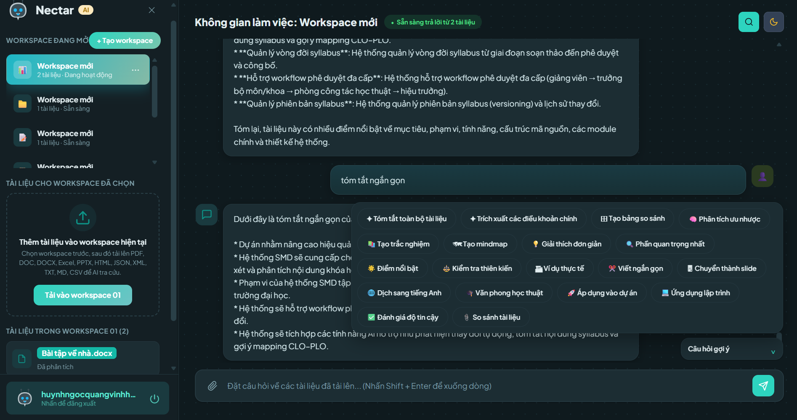
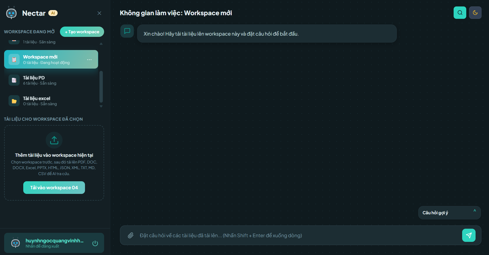

# 🚀 AI Document Question Answering System

An end-to-end RAG (Retrieval-Augmented Generation) application that allows users to upload documents and ask questions based on their content.

Built with FastAPI + LangChain + FAISS, designed using clean architecture principles and production-ready practices.

## 📌 Overview

This system enables:

- 📄 Upload documents (PDF, DOCX, TXT, CSV…)
- ❓ Ask questions related to uploaded content
- 🤖 Get grounded answers with sources
- 🧠 Reduce hallucination with strict fallback logic

✨ Key Features
- 🔍 RAG Pipeline: Ingest → Embed → Retrieve → Answer
- 🧠 Grounded Answers Only (no hallucination fallback)
- ⚡ FastAPI backend with clean architecture
- 📦 FAISS vector database for efficient retrieval
- 🔐 Optional authentication (register/login)
- 🧪 Unit tests with pytest
- 🐳 Dockerized for easy deployment
- 🔁 CI/CD pipeline with GitHub Actions
- 📊 Rate limiting & structured logging
- 💾 Vector backup & restore support

🏗️ Architecture
User → FastAPI → Upload → Document Processing
                        ↓
                  Text Chunking
                        ↓
                  Embeddings
                        ↓
                     FAISS
                        ↓
User Question → Retriever → LLM → Answer

🛠 Tech Stack
- Backend: FastAPI
- AI/LLM: LangChain, OpenAI / Groq / Gemini
- Vector DB: FAISS
- Testing: Pytest
- DevOps: Docker, GitHub Actions
- Frontend: Vanilla JS (Web UI)

📸 Demo
- home page interface.

- login or registration interface.

- messaging interface.

- document loading interface.

⚙️ Installation & Run (Local)
1. Clone project
git clone https://github.com/your-username/AI-Document-Question-Answering-System.git
cd AI-Document-Question-Answering-System
2. Setup environment
python -m venv .venv
source .venv/Scripts/activate   # Windows
3. Install dependencies
pip install -r requirements.txt
4. Setup environment variables
copy .env.example .env
👉 Thêm API key nếu có:
OPENAI_API_KEY=your_key_here
5. Run server
uvicorn main:app --reload
6. Open UI
http://127.0.0.1:8000/

🐳 Deploy with Docker (Recommended)
1. Build & run
docker compose up --build -d
2. Check service
http://127.0.0.1:8000/api/v1/health
3. Stop service
docker compose down

🌐 Production Deployment (Simple Guide)
- Option 1: Deploy to VPS
+ git clone <repo>
+ cd project
+ docker compose up -d
👉 Mở port 8000 là chạy được

- Option 2: Deploy to Cloud (Render / Railway)
- Connect GitHub repo
- Add environment variables
- Set start command:
- uvicorn main:app --host 0.0.0.0 --port 8000

📡 API Endpoints
- Method	Endpoint
- GET	/api/v1/health
- POST	/api/v1/upload
- POST	/api/v1/ask
- POST	/api/v1/auth/login

🧠 How It Works
- 📥 Upload Flow
- Upload file
- Extract text
- Split into chunks
- Generate embeddings
- Store in FAISS
❓ Ask Flow
- Retrieve top-k relevant chunks
- Filter by relevance
- Generate grounded answer
- If no result → return:
Không tìm thấy trong tài liệu

💡 Use Cases
- 📚 Internal knowledge assistant
- ⚖️ Legal document search
- 🏢 Company document Q&A
- 🤖 Customer support automation

🧪 Testing
- pytest -q

🔁 CI/CD
- Automated tests
- Docker build validation
- GitHub Actions pipeline

📦 Release Management
- Version: VERSION
- Changelog: CHANGELOG.md
- Deployment guide: docs/DEPLOY_RUNBOOK.md

🔐 Security
- CORS configurable
- Rate limiting
- Security headers (HSTS optional)
- No API key → fallback local model

📈 Future Improvements
- UI upgrade (React)
- Streaming responses
- Multi-user workspace
- Vector DB scaling (Pinecone / Weaviate)

👨‍💻 Author
Huỳnh Ngọc Quang Vinh

## 🔍 Details
### AIChatBox

This repository contains a production-quality RAG backend foundation with release-ready packaging and CI/CD using FastAPI + LangChain + FAISS.

## What is included

- Clean architecture project structure
- SOLID-first abstractions (interfaces)
- Dependency injection container
- API endpoints for health, auth, upload, ask
- Real document ingestion pipeline (upload -> load -> split -> embed -> FAISS)
- Real ask pipeline (retrieve top-k -> grounded answer)
- File-based optional authentication (register/login)
- Strict fallback rule for unanswered questions
- Tests for health, ask fallback, upload ingestion, and auth
- Docker packaging with runtime health checks
- CI workflow for automated tests and image build checks

## Run locally

1. Create and activate a Python 3.10+ environment.
2. Install dependencies:
   - `pip install -r requirements.txt`
3. Copy env file:
   - `copy .env.example .env`
4. Start server:
   - `uvicorn main:app --reload`
5. Open UI:
   - `http://127.0.0.1:8000/`

## Web UI

- A workspace-style chat interface is served at `/`
- File upload panel supports PDF, DOCX, TXT, MD, CSV and calls `/api/v1/upload`
- Chat composer calls `/api/v1/ask` and renders grounded answer with source chips
- Static assets live under `web/` and are mounted at `/static`

## Run with Docker

1. Create `.env` from `.env.example`.
2. Build and run:
   - `docker compose up --build -d`
   - Build profile follows `LOCAL_SEMANTIC_EMBEDDINGS` in `.env`:
     - `true`: installs local semantic dependencies (heavier image)
     - `false`: skips those optional dependencies (faster build)
3. Check service:
   - `http://127.0.0.1:8000/api/v1/health`
4. Stop service:
   - `docker compose down`

Note:
- Current Docker base image is kept as-is to maintain build/runtime compatibility.
- Local vulnerability scanners may still report OS-level CVEs depending on scanner database freshness.
- For stricter compliance, replace base image with your organization hardened image in production.

## CI/CD

- GitHub Actions workflow is at `.github/workflows/ci.yml`
- Pipeline stages:
  - install dependencies
  - run test suite (`pytest -q`)
   - run API smoke test
  - validate Docker image build

## Release management

- Current app version is tracked in `VERSION`
- Change history is tracked in `CHANGELOG.md`
- Deployment/rollback operations are documented in `docs/DEPLOY_RUNBOOK.md`

Release checklist:
1. Update `VERSION`
2. Append release notes in `CHANGELOG.md`
3. Run full tests (`pytest -q`)
4. Run smoke test (`python scripts/smoke_test.py --base-url http://127.0.0.1:8000`)
5. Build Docker image (`docker build -t aichatbox:<tag> .`)
6. Deploy with `docker compose up -d`

## Environment profiles

- Use `.env.example` profile snippets for development, staging, and production defaults
- For production, set strong values at minimum:
  - `OPENAI_API_KEY`
  - `AUTH_SECRET_KEY`
  - `ENABLE_HSTS=true` (when served over HTTPS)
  - stricter rate limits

## Available endpoints

- `GET /api/v1/health`
- `GET /api/v1/health/ready`
- `GET /api/v1/metrics`
- `GET /api/v1/ops/vector/status`
- `POST /api/v1/ops/vector/backup`
- `POST /api/v1/ops/vector/restore-latest`
- `POST /api/v1/auth/register` (optional, controlled by `ENABLE_REGISTRATION`)
- `POST /api/v1/auth/login`
- `POST /api/v1/upload`
- `POST /api/v1/ask`

## Supported document types

- `.pdf`
- `.docx`
- `.txt`
- `.md`
- `.csv`

## Ingestion behavior

- `/upload` now performs real ingestion and persists vectors into FAISS at `VECTOR_STORE_PATH`
- If `OPENAI_API_KEY` is provided, OpenAI embeddings are used
- If no API key is provided, deterministic local embeddings are used so local development and tests still work

## Ask behavior

- `/ask` retrieves top-k chunks from FAISS using the configured `TOP_K`
- Answer generation is grounded strictly on retrieved context
- Retrieved chunks are filtered by token-overlap relevance (`MIN_CONTEXT_TOKEN_OVERLAP`)
- If filtered relevant chunks are fewer than `MIN_RELEVANT_CHUNKS`, fallback is returned
- If no grounded answer is available, API returns exactly: `Không tìm thấy trong tài liệu`
- If `OPENAI_API_KEY` is not set, a local grounded provider is used for deterministic development and test behavior

## Reliability and logs

- Upload and ask flows emit structured logs for request outcomes
- Ingestion writes chunk-level metadata (for example, chunk index) for better source traceability
- Every response includes `X-Request-ID` for request tracing
- Ask and upload endpoints enforce configurable in-memory rate limiting

## Operational controls

- `RATE_LIMIT_WINDOW_SECONDS`: rolling window for request throttling
- `ASK_RATE_LIMIT_PER_WINDOW`: maximum ask requests per window per client
- `UPLOAD_RATE_LIMIT_PER_WINDOW`: maximum upload requests per window per client

## Security controls

- CORS is configurable via `CORS_ALLOW_ORIGINS`, `CORS_ALLOW_METHODS`, `CORS_ALLOW_HEADERS`, and `CORS_ALLOW_CREDENTIALS`
- Basic security headers are enabled via `ENABLE_SECURITY_HEADERS`
- HSTS can be enabled in HTTPS deployments via `ENABLE_HSTS`

## Backup and recovery

- Vector store backups are written under `VECTOR_BACKUP_DIR`
- Use `POST /api/v1/ops/vector/backup` to create a snapshot
- Use `POST /api/v1/ops/vector/restore-latest` to recover from latest snapshot

## Benchmark utility

- Run ask benchmark locally:
   - `python scripts/benchmark_ask.py --base-url http://127.0.0.1:8000 --runs 50 --question "FastAPI la gi?"`
