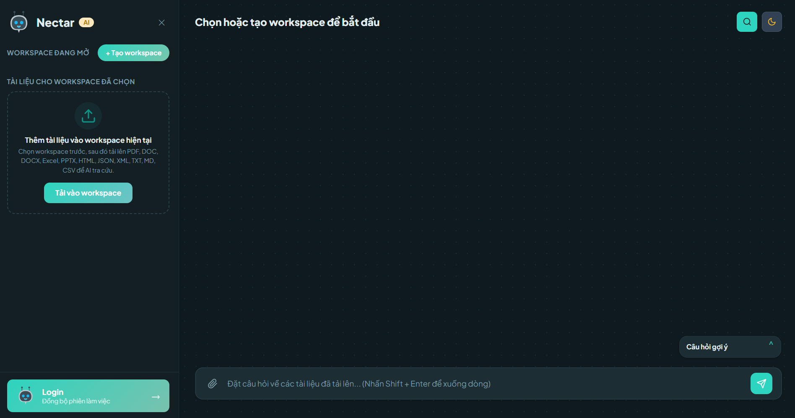
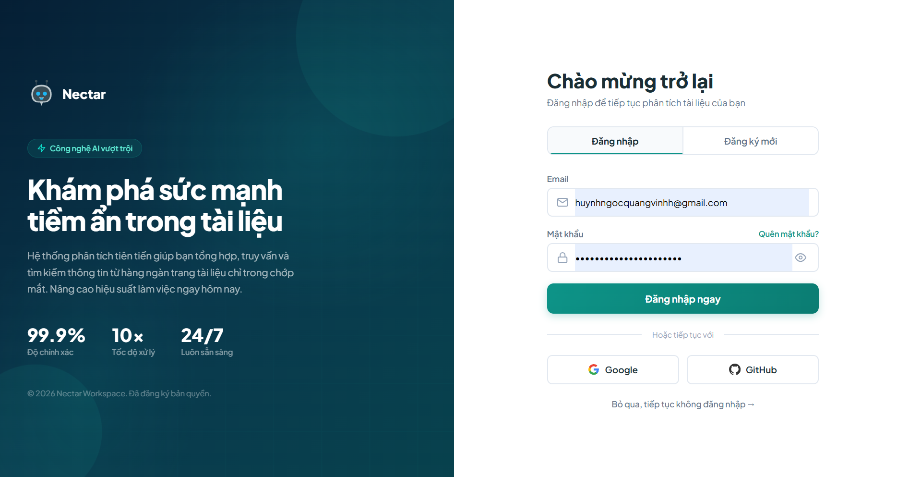
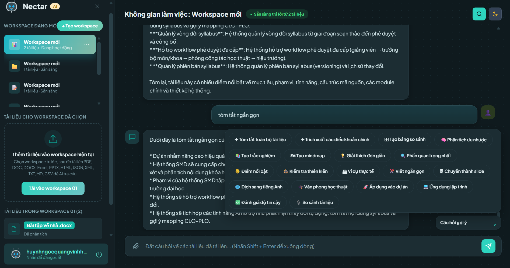
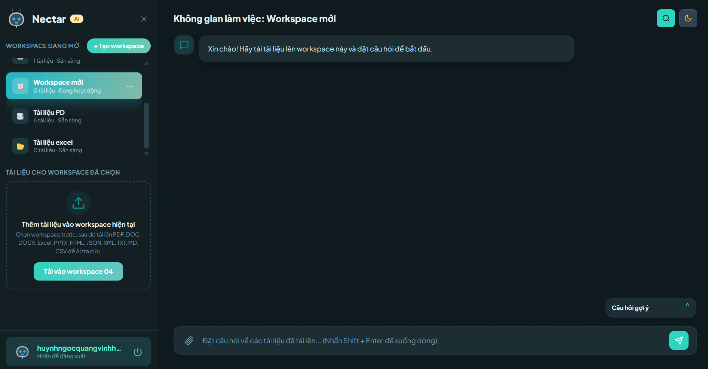

# 🚀 AIChatBox

AIChatBox là hệ thống RAG (Retrieval-Augmented Generation) end-to-end cho phép:

- Upload tài liệu vào workspace/chat cụ thể
- Hỏi đáp dựa trên nội dung tài liệu đã index
- Nhận câu trả lời có nguồn tham chiếu
- Quản trị người dùng và cấu hình hệ thống qua trang Admin

Hệ thống được xây dựng với FastAPI + LangChain + FAISS, theo hướng clean architecture, có CI/CD và đóng gói Docker.

## ✨ Tính năng chính

- Workspace đa chat cho từng user (hoặc guest session)
- Session đăng nhập theo tab (ưu tiên sessionStorage, có fallback localStorage)
- Upload nền (background job) + theo dõi trạng thái job + retry
- RAG pipeline: Ingest → Chunk → Embed → Retrieve → Grounded Answer
- Hỗ trợ hỏi đáp theo chat, theo tài liệu đã chọn, và streaming SSE
- Admin dashboard: thống kê, quản lý user, audit log, analytics
- Auth đầy đủ: register/login, forgot/reset password, OAuth (Google/GitHub)
- Rate limiting, structured logging, request tracing
- Vector backup/restore/clear cho vận hành

## 🏗️ Kiến trúc tổng quan

User/UI → FastAPI API → Ingestion/QA Services
                      → PostgreSQL (users/workspace/admin/upload jobs)
                      → FAISS (vector index)

## 🛠 Tech Stack

- Backend: FastAPI
- AI/LLM: LangChain, OpenAI / Groq / Gemini
- Vector DB: FAISS
- Metadata store: PostgreSQL
- Frontend: Vanilla JS (routes: `/`, `/login`, `/admin`)
- Testing: Pytest
- DevOps: Docker Compose, GitHub Actions

## 📸 Demo

- Home page interface
  
- Login / registration interface
  
- Messaging interface
  
- Document loading interface
  

## ⚙️ Chạy local

1. Clone repository

   ```bash
   git clone <your-repo-url>
   cd AIChatBox
   ```

2. Tạo virtual environment

   ```bash
   python -m venv .venv
   ```

3. Kích hoạt virtual environment

   Git Bash:

   ```bash
   source .venv/Scripts/activate
   ```

   PowerShell:

   ```powershell
   .\.venv\Scripts\Activate.ps1
   ```

4. Cài dependencies

   ```bash
   pip install -r requirements.txt
   ```

5. Tạo file môi trường

   ```bash
   copy .env.example .env
   ```

6. Chạy server

   ```bash
   uvicorn main:app --reload
   ```

7. Mở giao diện

- Workspace UI: `http://127.0.0.1:8000/`
- Login UI: `http://127.0.0.1:8000/login`
- Admin UI: `http://127.0.0.1:8000/admin`

## 🐳 Chạy với Docker (khuyến nghị)

`docker-compose.yml` khởi chạy **2 service**:

- `aichatbox-api` (FastAPI)
- `postgres` (PostgreSQL)

1. Build và chạy

   ```bash
   docker compose up --build -d
   ```

2. Kiểm tra health

   ```bash
   curl http://127.0.0.1:8000/api/v1/health
   ```

3. Dừng service

   ```bash
   docker compose down
   ```

Ghi chú:

- API expose qua port `8000` (config bằng `API_HOST_PORT`).
- PostgreSQL expose host port `5433` mặc định.
- Build profile local semantic embedding dùng biến `LOCAL_SEMANTIC_EMBEDDINGS`.

## 📡 API endpoints (rút gọn theo nhóm)

### Health & Metrics

- `GET /api/v1/health`
- `GET /api/v1/health/ready`
- `GET /api/v1/metrics`

### Ops (Vector Store)

- `GET /api/v1/ops/vector/status`
- `POST /api/v1/ops/vector/backup`
- `POST /api/v1/ops/vector/restore-latest`
- `POST /api/v1/ops/vector/clear`

### Auth

- `POST /api/v1/auth/register` (có thể tắt bằng `ENABLE_REGISTRATION`)
- `POST /api/v1/auth/login`
- `POST /api/v1/auth/forgot-password`
- `POST /api/v1/auth/reset-password`
- `GET /api/v1/auth/oauth/{provider}/start`
- `POST /api/v1/auth/oauth/{provider}/complete`

### Workspace

- `POST /api/v1/workspace/chats`
- `GET /api/v1/workspace/chats`
- `GET /api/v1/workspace/chats/{chat_id}/documents`
- `GET /api/v1/workspace/chats/{chat_id}/messages`
- `POST /api/v1/workspace/chats/{chat_id}/upload`
- `GET /api/v1/workspace/chats/{chat_id}/upload-jobs`
- `GET /api/v1/workspace/chats/{chat_id}/upload-jobs/{job_id}`
- `POST /api/v1/workspace/chats/{chat_id}/upload-jobs/{job_id}/retry`
- `POST /api/v1/workspace/chats/{chat_id}/ask`
- `POST /api/v1/workspace/chats/{chat_id}/ask/stream`
- `PUT /api/v1/workspace/chats/{chat_id}`
- `DELETE /api/v1/workspace/chats/{chat_id}`
- `DELETE /api/v1/workspace/chats/{chat_id}/messages`
- `DELETE /api/v1/workspace/chats/{chat_id}/documents`
- `PUT /api/v1/workspace/chats/{chat_id}/documents/{document_id}`
- `DELETE /api/v1/workspace/chats/{chat_id}/documents/{document_id}`

### Admin

- `POST /api/v1/admin/setup`
- `GET /api/v1/admin/dashboard`
- `GET /api/v1/admin/users`
- `GET /api/v1/admin/users/{username}`
- `PUT /api/v1/admin/users/{username}/role`
- `PUT /api/v1/admin/users/{username}/status`
- `DELETE /api/v1/admin/users/{username}`
- `POST /api/v1/admin/users/{username}/reset-password`
- `GET /api/v1/admin/system/metrics`
- `GET /api/v1/admin/system/config`
- `GET /api/v1/admin/audit-logs`
- `GET /api/v1/admin/analytics/usage`

### Legacy endpoints (vẫn còn hỗ trợ)

- `POST /api/v1/upload`
- `POST /api/v1/ask`

## 📄 Loại tài liệu hỗ trợ

Có thể cấu hình qua `SUPPORTED_UPLOAD_EXTENSIONS`.

Mặc định hệ thống hỗ trợ:

- `.pdf`, `.doc`, `.docx`
- `.xlsx`, `.pptx`
- `.html`, `.htm`, `.json`, `.xml`
- `.txt`, `.md`, `.csv`
- `.png`, `.jpg`, `.jpeg`, `.webp`, `.bmp`, `.tif`, `.tiff`, `.gif`

## 🧠 Hành vi RAG

- Ingestion lưu vector vào `VECTOR_STORE_PATH`.
- Nếu có API key embeddings phù hợp, hệ thống dùng provider tương ứng.
- Nếu không có API key, hệ thống dùng local semantic embeddings/local grounded fallback để chạy ổn định ở môi trường dev/test.
- Khi không đủ ngữ cảnh liên quan, API trả fallback:

  ```
  Không tìm thấy trong tài liệu
  ```

## 🔐 Security & Reliability

- CORS cấu hình qua biến môi trường
- Security headers bật qua `ENABLE_SECURITY_HEADERS`
- HSTS bật qua `ENABLE_HSTS` khi triển khai HTTPS
- Rate limit cho login/register/ask/upload
- Structured log và request ID để trace

## 🧪 Testing

```bash
pytest -q
```

## 🔁 CI/CD

Workflow: `.github/workflows/ci.yml`

Pipeline hiện tại:

- Cài dependencies
- Chạy test suite (`pytest -q`)
- Chạy smoke test API (`scripts/smoke_test.py`)
- Validate Docker image build

## 📊 Benchmark utilities

- Ask latency benchmark:

  ```bash
  python scripts/benchmark_ask.py --base-url http://127.0.0.1:8000 --runs 50 --question "FastAPI la gi?"
  ```

- Ingestion benchmark:

  ```bash
  python scripts/benchmark_ingestion.py --runs 1 --output tmp/benchmark_ingestion_results.json
  ```

## 📦 Release management

- Version hiện tại: `VERSION`
- Changelog: `CHANGELOG.md`
- Runbook triển khai/rollback: `docs/DEPLOY_RUNBOOK.md`

Checklist đề xuất:

1. Update `VERSION`
2. Cập nhật `CHANGELOG.md`
3. Chạy `pytest -q`
4. Chạy smoke test API
5. Build image: `docker build -t aichatbox:<tag> .`
6. Deploy: `docker compose up -d`

## 👨‍💻 Author

Huỳnh Ngọc Quang Vinh
